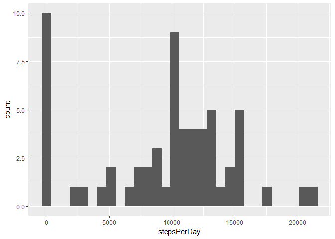
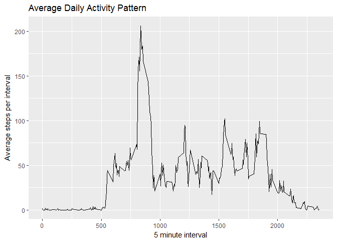
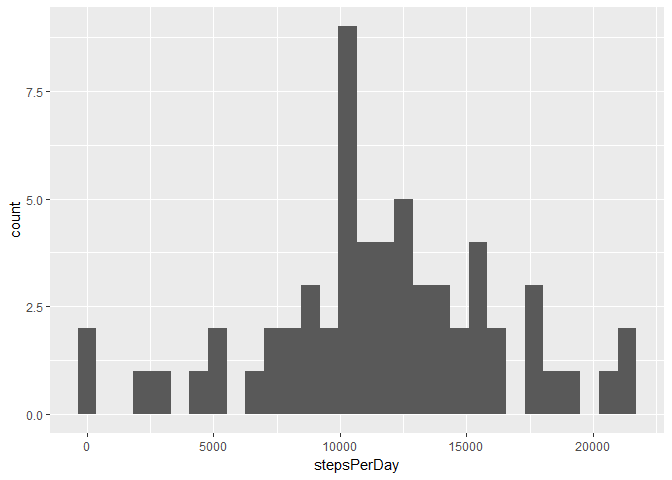
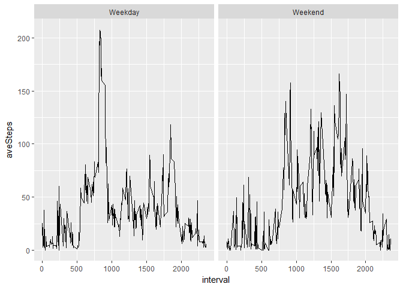

Loading and preprocessing the data
==================================

    df <- read.csv(unz("activity.zip", "activity.csv"), stringsAsFactors = FALSE)

    head(df)

    ##   steps       date interval
    ## 1    NA 2012-10-01        0
    ## 2    NA 2012-10-01        5
    ## 3    NA 2012-10-01       10
    ## 4    NA 2012-10-01       15
    ## 5    NA 2012-10-01       20
    ## 6    NA 2012-10-01       25

What is mean total number of steps taken per day?
=================================================

We begin by

1.  Calculating the total number of steps taken per day

2.  Building a histogram of the total number of steps taken each day

3.  And calculating the mean and median of the total number of steps per
    day across all the days.

<!-- -->

    totalSteps <- ddply(df, c("date"), summarize, stepsPerDay = sum(steps, na.rm = TRUE))
    ggplot(data = totalSteps, aes(stepsPerDay )) + geom_histogram()

    ## `stat_bin()` using `bins = 30`. Pick better value with `binwidth`.

    mean <- mean(totalSteps$stepsPerDay)
    median <- median(totalSteps$stepsPerDay)
    data.frame(mean, median)

    ##      mean median
    ## 1 9354.23  10395

What is the average daily activity pattern?
===========================================

To look into this we will

1.  Make a time series plot of the average number of steps taken. This
    is the average by interval across days.

2.  Identify the 5-minute interval which on average contains the maximum
    number of steps.

<!-- -->

    byInterval <- ddply(df, c("interval"), summarize, aveSteps = mean(steps, na.rm = TRUE))

    ggplot(data = byInterval) +
        geom_line(aes(x=interval, y = aveSteps, group = 1)) +
        labs(x = "5 minute interval", y = "Average steps per interval") + 
        ggtitle("Average Daily Activity Pattern")

    maxSteps <- max(byInterval$aveSteps)
    interval<- byInterval[byInterval$aveSteps == max(byInterval$aveSteps),]$interval
    data.frame(maxSteps, interval)

    ##   maxSteps interval
    ## 1 206.1698      835

Imputing missing values
=======================

1.  First let's look at the number of missing values.

<!-- -->

    rowsWithNAs <- dim(is.na(df))[1]
    rowsWithNAs

    ## [1] 17568

1.  That's a lot. We can use a prebuilt method to fill these in using
    the "mice" library and the pmm (predictive mean matching) method.
    This function call generates 1 completed data frame with
    imputed values.

2.  We'll build a new dataset with the imputed values included.

<!-- -->

    library(mice)

    ## Loading required package: lattice

    tempdf <- mice(data = df, m = 1, method = "pmm", maxit = 10)

    ## 
    ##  iter imp variable
    ##   1   1  steps
    ##   2   1  steps
    ##   3   1  steps
    ##   4   1  steps
    ##   5   1  steps
    ##   6   1  steps
    ##   7   1  steps
    ##   8   1  steps
    ##   9   1  steps
    ##   10   1  steps

    completedf <- complete(tempdf, 1)

1.  Now let's look at a histogram of the total number of steps taken
    each day after missing values are imputed along with the new mean
    and median of average total steps taken across days.

<!-- -->

    completeTotalSteps <- ddply(completedf, c("date"), summarize, stepsPerDay = sum(steps))
    ggplot(data = completeTotalSteps, aes(stepsPerDay)) + geom_histogram()

    ## `stat_bin()` using `bins = 30`. Pick better value with `binwidth`.

    mean <- mean(completeTotalSteps$stepsPerDay)
    median <- median(completeTotalSteps$stepsPerDay)
    data.frame(mean, median)

    ##       mean median
    ## 1 11658.64  11458

We can see that we no longer have as many days with 0 total steps. And
because we've filled in missing values, both our mean and median for
total steps per day have increased.

Are there differences in activity patterns between weekdays and weekends?
=========================================================================

To answer this question we first need to

1.  Identify dates in the data as weekdays or weekends.

2.  Average steps per interval across all weekend days and again across
    all weekday days.

3.  Plot the resulting averaged data in separate panels.

<!-- -->

    completedf$day <- weekdays(as.Date(completedf$date))
    completedf$weekend <- ifelse(completedf$day %in% c("Saturday","Sunday"), "Weekend", "Weekday")

    res <- ddply(completedf, c("interval","weekend"), summarize, aveSteps = mean(steps, na.rm = TRUE))

    ggplot(res, aes(interval, aveSteps)) + geom_line() + facet_grid( .~ weekend)

Sure looks like there is an activity pattern difference! That early
morning spike in movement during the week gets smoothed out and pushed
back into a nice slow morning in the weekend. And the weekend shows
higher activity levels in the middle of the day, hopefully because fewer
people are sitting around at desks.
